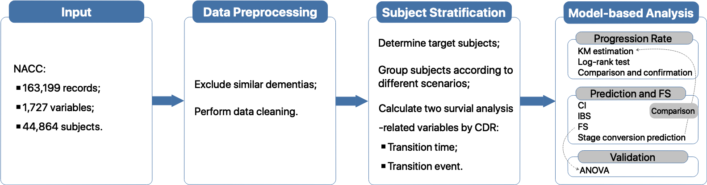
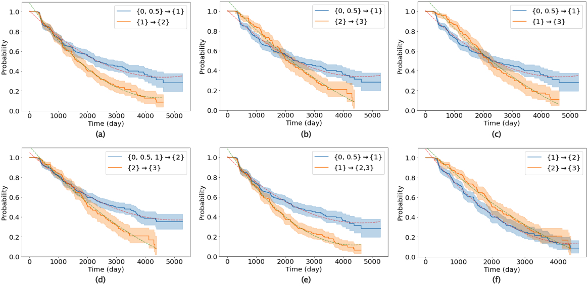
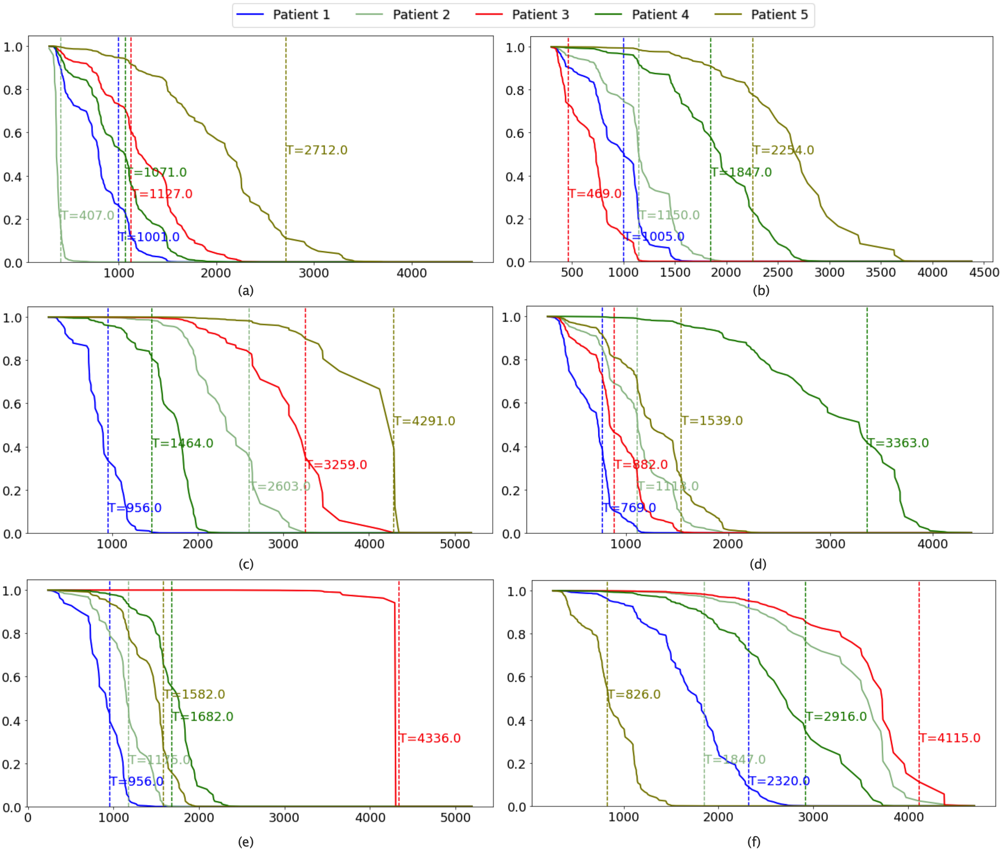

# Machine learning approach predicts probability of time to stage-specific conversion of Alzheimer’s disease (Journal of Alzheimer's Disease 2022)

Paper link: https://content.iospress.com/articles/journal-of-alzheimers-disease/jad220590

---

## Table of contents
* [Background](#Background)
* [Methods](#Methods)
* [Results](#Results)
* [Conclusion](#Conclusion)
* [Prerequisites](#Prerequisites)
* [Datasets](#Datasets)
* [Approach](#approach)
* [HowtoCite](#HowtoCite)
* [History](#History)
* [License](#License)
* [Contacts](#Contacts)

---

## Background

The progression of Alzheimer’s disease (AD) varies in different patients at different stages, which makes predicting the time of disease conversions challenging. 
Objective: We established an algorithm by leveraging machine learning techniques to predict the probability of the conversion time to next stage for different subjects during a given period.

## Methods

Firstly, we used Kaplan-Meier (KM) estimation to get the transition curves of different AD stages, and calculated Log-rank statistics to test whether the progression rate between different stages was identical. This quantitatively confirmed the progression rates known in the literature. Then, we developed an approach based on deep learning model, DeepSurv, to predict the probabilities of time-to-conversion. Finally, to help interpret the deep learning model in our approach, we identified important variables contributing the most to the DeepSurv prediction, whose significance were validated with the analysis of variance (ANOVA).

## Results

Our machine learning approach predicted the time to conversion with a high accuracy. For each of the different stages, the concordance index (CI) of our approach was at least 86%, and the integrated Brier score (IBS) was less than 0.1. To facilitate interpretability of the prediction results, our approach identified the top 10 variables for each disease conversion scenario, which were clinicopathologically meaningful, and most of them were also statistically significant.

## Conclusion

Our study has the potential to provide individualized prediction for future time course of AD conversions years before their actual occurrence, thus facilitating personalized prevention and intervention strategies to slow down the progression of AD.

## Prerequisites

Python 3.7.8

JupyterLab 3.2.9

## Datasets

Our approach of predictive modeling and analysis was established on the large prospective cohort, the National Alzheimers Coordinating Center (NACC) with subjects’ multiple-visit information between 2005 and 2020, which can be accessed upon request and approval by the data owner via the link https://naccdata.org/.

## Approach

Schematic illustration of our workflow for deep learning-based stage-stratified prediction of probabilities of time to AD conversion.

Some resutls:

## HowtoCite

**If you find this code useful in your research, please consider citing our work:**

Xinxing Wu, Chong Peng, Peter T. Nelson, and Qiang Cheng. Machine learning approach predicts probability of time to stage-specific conversion of Alzheimer’s disease. Journal of Alzheimer's Disease, 90 (2):1-13, 2022. https://content.iospress.com/articles/journal-of-alzheimers-disease/jad220590

---
## History

* Version 1.0 (Sep. 03, 2022)

---
## License

Distributed under the MIT license. See [``LICENSE``](https://github.com/xinxingwu-uk/AD_Survival/blob/main/LICENSE) for more information.

---

## Contacts

Xinxing Wu (xinxingwu@gmail.com) and Qiang Cheng (qiang.cheng@uky.edu)
